# صوت‌نهان · Audio Stegano

**نسخه / Version:** `1.0.0+1`  
**شناسه اندروید / Android ID:** `ca.karavi.audiowmark.app`  
**مخزن / Repository:** [github.com/akaravi/Karavi.Thesis.AudioSignalStealthLogisticChaosMapping.App](https://github.com/akaravi/Karavi.Thesis.AudioSignalStealthLogisticChaosMapping.App)

## فهرست | Table of contents

| موضوع (فا) | Topic (EN) |
|------------|------------|
| [معرفی](#معرفی) · [ویژگی‌ها](#ویژگی‌ها) · [اسکرین‌شات](#پیش‌نمایش-رابط-اسکرین‌شات-۱۶۹) · [راهنما](#راهنمای-کاربر) | [Overview](#overview) · [Features](#features) · [Screenshots](#ui-preview-169-screenshots) · [Guide](#user-guide) |
| [ساختار](#ساختار-مخزن) · [اجرا](#اجرای-سریع) · [انتشار](#انتشار) | [Layout](#repository-layout) · [Run](#quick-start) · [Publish](#publishing) |
| [پایان‌نامه و تماس](#درباره-پروژه-و-پایان‌نامه) | [Thesis & links](#about-the-project--thesis) |
| [پیش‌نیازها](#پیش‌نیازهای-توسعه) · [معماری](#معماری-الگوریتم) · [عیب‌یابی](#عیب‌یابی-رایج) | [Prerequisites](#development-prerequisites) · [Architecture](#algorithm-architecture) · [Troubleshooting](#common-issues) |

---

## فارسی

### معرفی

**صوت‌نهان** (Audio Stegano) اپلیکیشن چندسکویی برای **نهان‌نگاری پیام متنی داخل فایل صوتی** است. الگوریتم بر پایه **LSB** و **نقشه آشوب لاجستیک** (پورت از اسکریپت‌های MATLAB پایان‌نامه) پیاده‌سازی شده است. پیام داخل موج صدا پنهان می‌شود و با **همان کلید** (`seed`، پارامترهای `r` و `x0`) و **طول پیام به بیت** قابل استخراج است.

- پردازش **روی دستگاه** — بدون ارسال خودکار به سرور  
- رابط **فارسی، انگلیسی، عربی و فرانسوی**  
- تم **روشن و تاریک**  
- پلتفرم‌ها: **Android**، **Windows**، **Linux** (Flutter) و **Windows** (WPF / .NET)

### ویژگی‌ها

| قابلیت | توضیح |
|--------|--------|
| **نهان‌نگاری (Embed)** | تایپ پیام، ضبط میکروفن یا بارگذاری WAV/MP3، تولید فایل استگانو |
| **رمزگشایی (Extract)** | بازیابی پیام از فایل یا ضبط؛ پشتیبانی «باز کردن با» در اندروید |
| **کلید آشوب** | `seed`، `r`، `x0` — دستی یا با اسلایدر |
| **متریک کیفیت** | SNR، PSNR، BER و سایر شاخص‌ها با راهنمای هر متریک |
| **تأیید فوری** | استخراج و مقایسه بلافاصله پس از نهان‌نگاری |
| **اشتراک‌گذاری** | ذخیره/ارسال WAV — توصیه: ارسال به‌صورت **فایل** نه پیام صوتی فشرده |

### پیش‌نمایش رابط (اسکرین‌شات ۱۶:۹)

تصاویر زیر از [`docs/cafebazaar/screenshots_16x9/`](docs/cafebazaar/screenshots_16x9/) — رزولوشن **1920×1080** PNG.

| ۱ — اسپلش / معرفی | ۲ — راهنمای سریع | ۳ — انتخاب زبان |
|:---:|:---:|:---:|
| 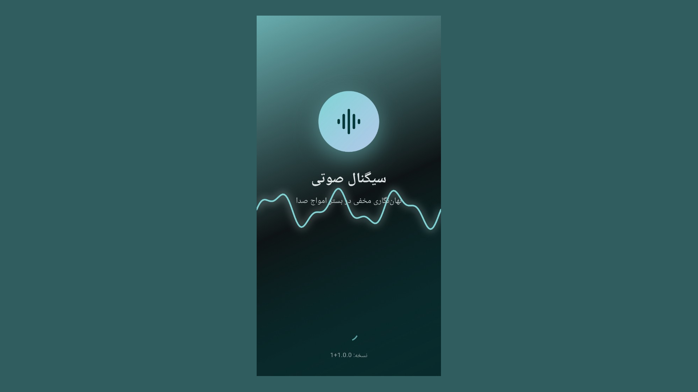 | 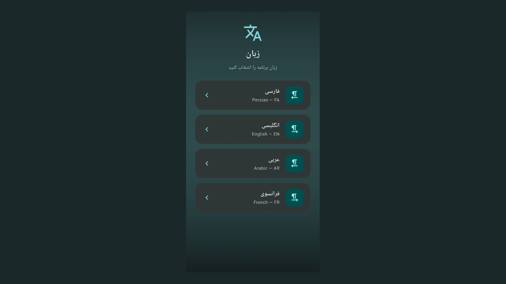 | 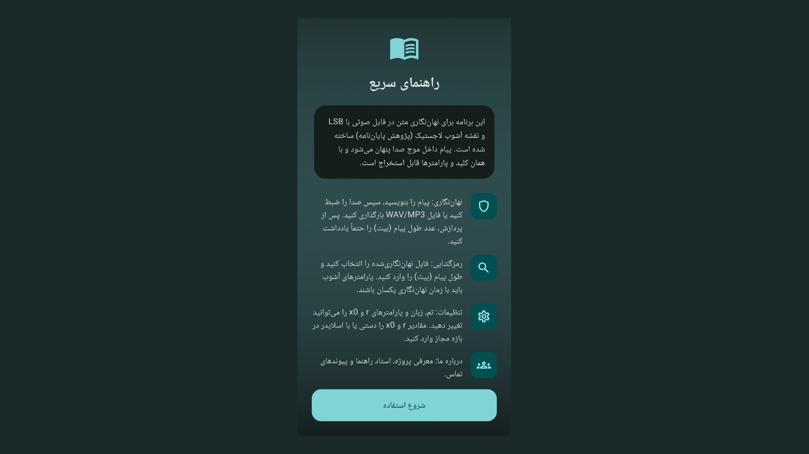 |

| ۴ — نهان‌نگاری: ورودی | ۵ — نهان‌نگاری: ضبط | ۶ — دیالوگ طول پیام |
|:---:|:---:|:---:|
| 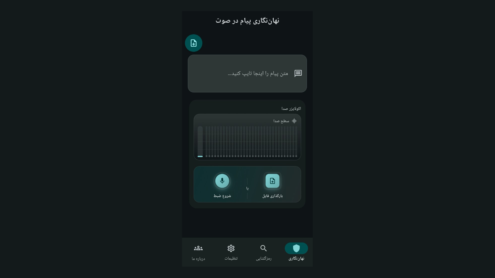 | 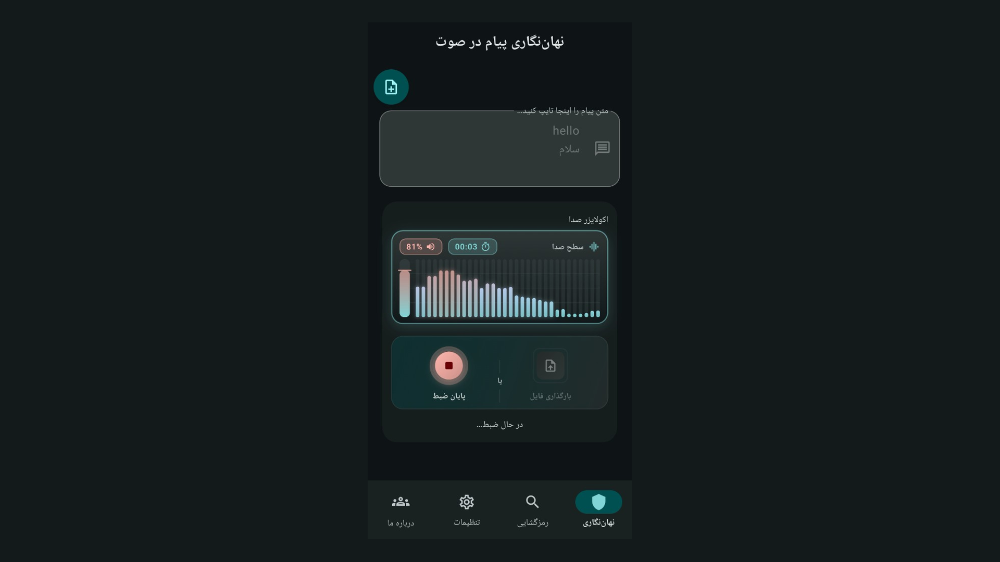 | 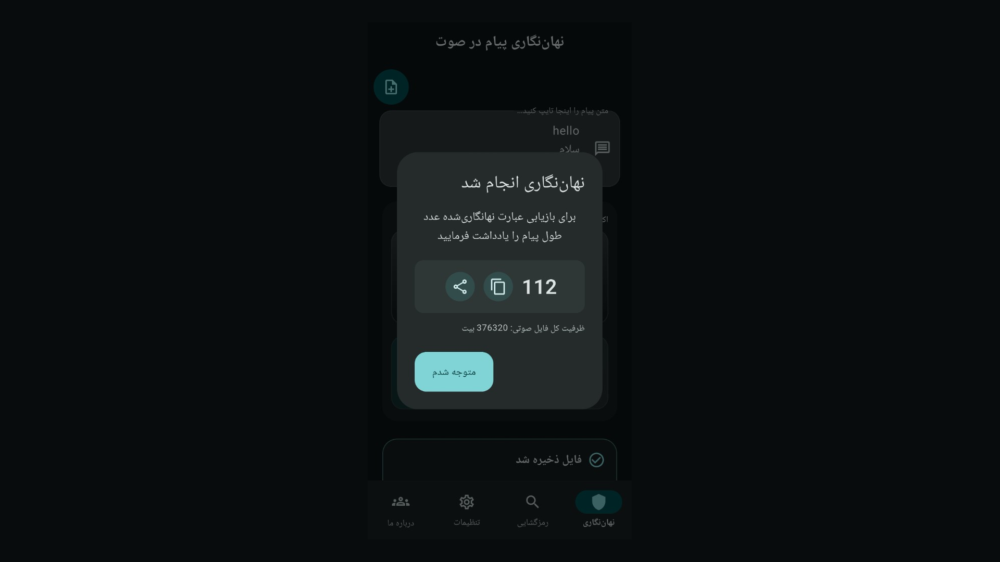 |

| ۷ — موج و متریک | ۸ — رمزگشایی | ۹ — نتیجه رمزگشایی |
|:---:|:---:|:---:|
| 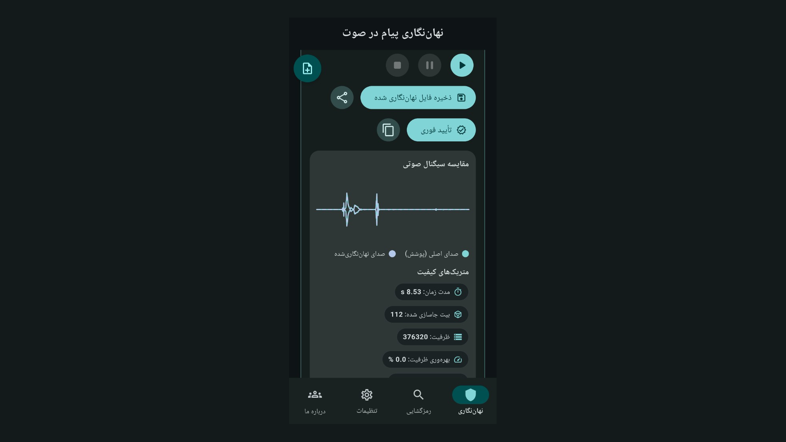 | 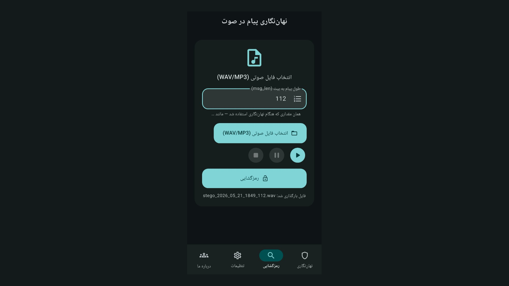 | 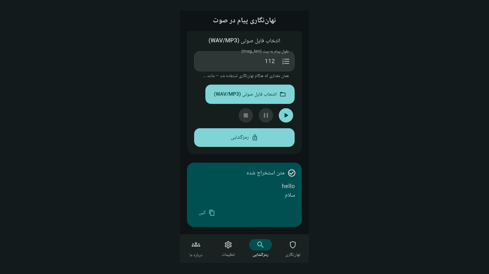 |

| ۱۰ — تنظیمات (تم/زبان) | ۱۱ — پارامترهای کلید |
|:---:|:---:|
| 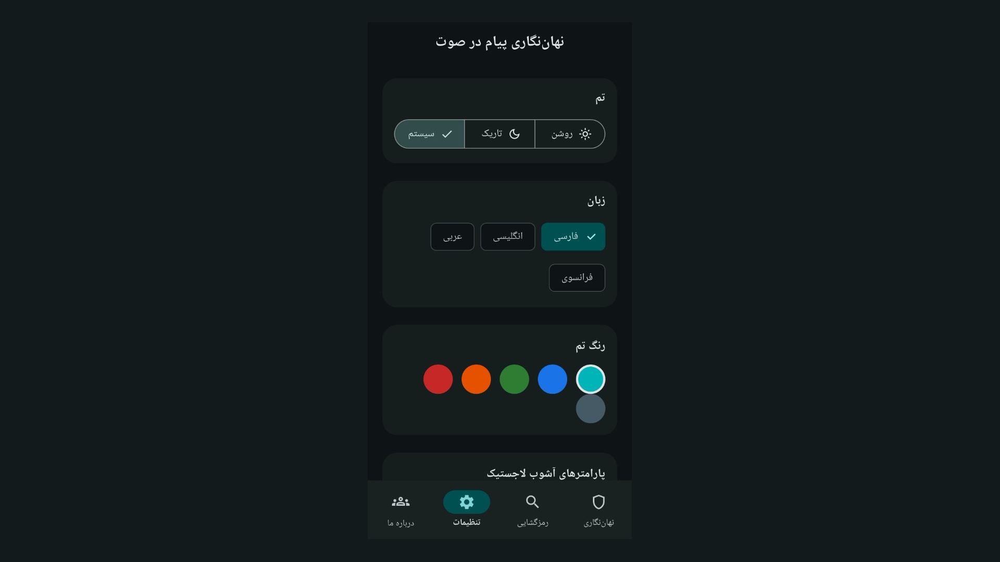 | 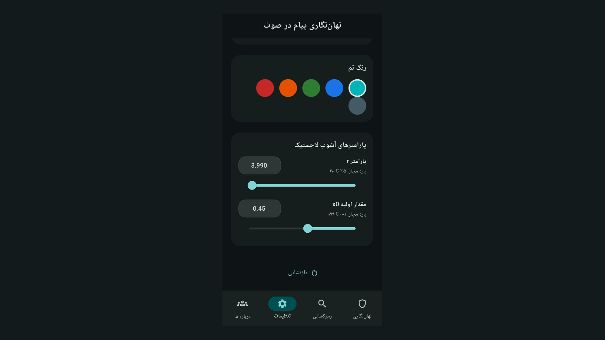 |

### راهنمای کاربر

#### تب‌های برنامه

| تب | کاربرد |
|----|--------|
| **نهان‌نگاری** | پنهان‌سازی پیام در صوت |
| **رمزگشایی** | استخراج پیام از فایل صوتی |
| **تنظیمات** | تم، زبان، رنگ و پارامترهای کلید (`r`، `x0`، `seed`) |
| **درباره ما** | معرفی پروژه، استاد راهنما و پیوندهای تماس |

#### راهنمای سریع (اولین اجرا)

1. **هدف برنامه:** پنهان‌سازی متن در صوت با LSB و نقشه آشوب لاجستیک؛ بازیابی با همان کلید و پارامترها.  
2. **نهان‌نگاری:** پیام را بنویسید → صدا را ضبط کنید یا فایل WAV/MP3 بارگذاری کنید → پس از پردازش **عدد طول پیام (بیت)** را حتماً یادداشت کنید.  
3. **رمزگشایی:** فایل نهان‌نگاری‌شده را انتخاب کنید → طول پیام (بیت) را وارد کنید → `r` و `x0` باید با زمان نهان‌نگاری **یکسان** باشند.  
4. **تنظیمات:** تم، زبان، و پارامترهای `r` / `x0`.  
5. **درباره ما:** معرفی پروژه، استاد راهنما و راه‌های تماس.

#### مراحل نهان‌نگاری (کامل)

1. متن پیام را در کادر مربوط وارد کنید.  
2. **شروع ضبط** (میکروفن) یا **بارگذاری فایل** (WAV/MP3).  
3. در صورت ضبط، **پایان ضبط** — پردازش خودکار و ساخت فایل استگانو.  
4. **طول پیام (بیت)** را از پنجره کپی یا یادداشت کنید — برای رمزگشایی **الزامی** است.  
5. پخش فایل، مقایسه موج اصلی/استگانو و مشاهده متریک‌ها (روی هر متریک کلیک → توضیح).  
6. **تأیید فوری** برای استخراج و مقایسه با متن اصلی.  
7. **ذخیره** یا **اشتراک** — فایل را به‌صورت **پیوست فایل** بفرستید، نه «صدای ضبط‌شده» در پیام‌رسان.  
8. **نهان‌نگاری جدید** برای شروع دوباره.

#### مراحل رمزگشایی (کامل)

1. **انتخاب فایل صوتی** (WAV/MP3/MP4) — در اندروید می‌توانید از «باز کردن با» استفاده کنید.  
2. **طول پیام (بیت)** — همان عددی که هنگام نهان‌نگاری ذخیره کردید؛ بدون آن استخراج ممکن نیست.  
3. در **تنظیمات**، `r` و `x0` (و در صورت نیاز `seed`) را دقیقاً مطابق زمان نهان‌نگاری تنظیم کنید.  
4. **(اختیاری)** پخش/مکث/توقف برای اطمینان از فایل صحیح.  
5. **رمزگشایی** — متن در کارت «متن استخراج‌شده» نمایش داده می‌شود.  
6. **کپی** — دکمه کپی در پایین کارت نتیجه.

#### تنظیمات و کلید آشوب

| پارامتر | نقش |
|---------|-----|
| **`seed`** | بذر تولید کلید دودویی از نقشه لاجستیک |
| **`r`** | پارامتر آشوب (بازه مجاز در اپ با اسلایدر محدود شده) |
| **`x0`** | مقدار اولیه نقشه — حساسیت بالا؛ تغییر جزئی کلید را عوض می‌کند |

مقادیر را **دستی** یا با **اسلایدر** وارد کنید. برای رمزگشایی موفق، هر سه مقدار باید با زمان نهان‌نگاری **یکسان** باشند.

#### متریک‌های کیفیت (پس از نهان‌نگاری)

روی هر متریک در صفحه نهان‌نگاری بزنید تا توضیح کامل باز شود:

| متریک | خلاصه |
|-------|--------|
| مدت / ظرفیت | طول صوت، بیت‌های جاسازی‌شده، ظرفیت و درصد استفاده |
| طول پیام (بیت) | همان عددی که برای رمزگشایی لازم است |
| **SNR** / **PSNR** | کیفیت سیگنال نسبت به نویز |
| **BER** | نرخ خطای بیت پس از بازیابی آزمایشی |
| **NPCR** / **UACI** | تغییر پیکسلی/دامنه‌ای بین سیگنال اصلی و استگانو |

#### نکات مهم

- **طول پیام (بیت)**، `r` و `x0` را **با هم** یادداشت کنید — هر سه برای رمزگشایی الزامی‌اند.  
- پردازش **فقط روی دستگاه** است؛ پیام یا فایل به سرور ارسال نمی‌شود.  
- خروجی **WAV** است — فشرده‌سازی مجدد (مثلاً Voice در پیام‌رسان) داده نهان را خراب می‌کند.  
- فایل را به‌صورت **پیوست سند/فایل** بفرستید، نه «صدای ضبط‌شده».  
- راهنمای کامل داخل اپ: آیکن **؟** در نوار بالا.

### درباره پروژه و پایان‌نامه

**عنوان پژوهش:** نهان‌نگاری مخفی سیگنال صوتی با نگاشت آشوب لاجستیک  
**توسعه‌دهنده:** علیرضا کاروی — NTK  
**استاد راهنما:** دکتر مهدی مصلح  

| پیوند | آدرس |
|-------|------|
| مخزن اپلیکیشن | [Karavi.Thesis.AudioSignalStealthLogisticChaosMapping.App](https://github.com/akaravi/Karavi.Thesis.AudioSignalStealthLogisticChaosMapping.App) |
| مخزن پایان‌نامه | [Karavi.Thesis.AudioSignalStealthLogisticChaosMapping](https://github.com/akaravi/Karavi.Thesis.AudioSignalStealthLogisticChaosMapping) |
| وب‌سایت شخصی | [alikaravi.com](https://alikaravi.com) |
| شرکت NTK | [ntk.ir](https://ntk.ir) |

### ساختار مخزن

```
Karavi.Thesis.AudioSignalStealthLogisticChaosMapping.App/
├── src/
│   ├── audio_stegano_app/       # Flutter (Android / Windows / Linux / Web)
│   ├── audio_stegano_desktop/   # .NET 10 WPF (Windows)
│   └── Matlab/                  # مرجع الگوریتم (منبع حقیقت)
├── docs/
│   ├── cafebazaar-publish-guide.md
│   ├── GITHUB_RELEASE.md
│   └── cafebazaar/screenshots_16x9/   # اسکرین‌شات فروشگاه
├── publish/cafebazaar/          # خروجی بیلد بازار (پس از build)
├── _dev-ports.ps1               # پورت‌های لوکال 5320–5329
├── _last-run-info.ps1           # تولید LastRunInfo.html
├── _last-run-info.template.html # قالب UTF-8 (عناوین فارسی)
├── _run-all-local.ps1           # اجرای همهٔ سرویس‌های dev + health
├── LastRunInfo.html             # گزارش آخرین اجرا (تولید خودکار)
├── _build-all-projects.ps1
├── _build-cafebazaar-release.ps1
├── _build-github-release.ps1
├── _update-ver.ps1
├── Cursor.01.plan.md
└── readmehistory.md
```

### اجرای سریع

#### پورت‌های توسعهٔ لوکال (5320–5329)

| پورت | سرویس |
|------|--------|
| **5320** | Flutter Web (`web-server`) — `http://127.0.0.1:5320/` |
| **5321** | Flutter Web (`chrome` / `edge`) |
| **5322** | رزرو — WPF (بدون HTTP) |
| **5323** | Flutter Windows — VM service |
| **5324** | Dart DevTools |
| **5325–5329** | رزرو |

منبع واحد: [`_dev-ports.ps1`](_dev-ports.ps1). اجرای همهٔ سرویس‌های لوکال:

```powershell
.\_run-all-local.ps1
# توقف و اجرای مجدد: .\_run-all-local.ps1 -RestartAll
```

پس از هر اجرای لوکال، گزارش **`LastRunInfo.html`** در ریشه مخزن به‌روز می‌شود (سه جدول: نتیجه اجرا، آدرس سرویس‌ها، تخصیص پورت‌ها). قانون: `.cursor/rules/last-run-info-html.mdc`.

#### Flutter (توسعه)

```powershell
cd src/audio_stegano_app
flutter pub get
flutter run -d windows --host-vmservice-port=5323 --devtools-port=5324
flutter run -d web-server --web-port=5320 --web-hostname=127.0.0.1
```

#### دسکتاپ .NET (WPF)

```powershell
cd src/audio_stegano_desktop
dotnet build AudioStegano.sln
dotnet run --project src/AudioStegano.Desktop
```

#### MATLAB (مرجع)

اسکریپت‌های الگوریتم در `src/Matlab/`.

### انتشار

| هدف | راهنما |
|-----|--------|
| **کافه‌بازار (Android)** | [`docs/cafebazaar-publish-guide.md`](docs/cafebazaar-publish-guide.md) |
| **GitHub Release** | [`docs/GITHUB_RELEASE.md`](docs/GITHUB_RELEASE.md) |

**کافه‌بازار — خلاصه:**

```powershell
# یک‌بار: keystore + key.properties
.\src\audio_stegano_app\android\scripts\create_release_keystore.ps1
Copy-Item src\audio_stegano_app\android\key.properties.example src\audio_stegano_app\android\key.properties
# بیلد
.\_build-cafebazaar-release.ps1
# خروجی: publish/cafebazaar/  (فایل .bin برای App Bundle)
```

**GitHub Release — خلاصه:**

```bash
git tag publish/1.0.0+1
git push origin publish/1.0.0+1
```

اگر Actions به‌خاطر Billing متوقف شد:

```powershell
.\_publish-local-github-release.ps1 -TagName publish/1.0.0+1
```

### افزایش نسخه (`update ver`)

```powershell
.\_update-ver.ps1          # پیش‌نمایش: -WhatIf
```

مثال: `1.0.0+1` → `1.1.0+2`. منبع حقیقت: `src/audio_stegano_app/pubspec.yaml` (هم‌زمان با WPF).

### مجوزها (اندروید)

| مجوز | دلیل |
|------|------|
| میکروفن | ضبط صدا برای نهان‌نگاری و استخراج |
| فایل صوتی (Android 13+) | انتخاب WAV/MP3 از حافظه |

### پشتیبانی

- **ایمیل:** [karavi@ntk.ir](mailto:karavi@ntk.ir)  
- **تلفن:** 031-33355555  

### حریم خصوصی

پردازش صدا و متن **روی دستگاه** انجام می‌شود. در نسخه فعلی ارسال خودکار داده به سرور وجود ندارد. مجوز میکروفن و فایل صوتی فقط برای ضبط و انتخاب فایل محلی است.

---

## English

### Overview

**Audio Stegano** (Persian name: *Sot-Nehan* / صوت‌نهان) is a cross-platform app for **hiding text messages inside audio files**. It uses **LSB steganography** and a **logistic chaos map** (ported from the thesis MATLAB scripts). The message is embedded in the waveform and can be recovered only with the **same key** (`seed`, parameters `r` and `x0`) and the **message length in bits**.

- **On-device processing** — no automatic upload to a server  
- UI in **Persian, English, Arabic, and French**  
- **Light and dark** themes  
- Targets: **Android**, **Windows**, **Linux** (Flutter), and **Windows** (WPF / .NET)

### Features

| Feature | Description |
|---------|-------------|
| **Embed** | Type a message, record from the mic or upload WAV/MP3, produce a stego file |
| **Extract** | Recover the message from a file or recording; Android “Open with” supported |
| **Chaos key** | `seed`, `r`, `x0` — manual entry or sliders |
| **Quality metrics** | SNR, PSNR, BER, and more — tap a metric for help |
| **Instant verify** | Extract and compare right after embedding |
| **Share** | Save/send WAV — send as a **file attachment**, not recompressed voice |

### UI preview (16:9 screenshots)

Images from [`docs/cafebazaar/screenshots_16x9/`](docs/cafebazaar/screenshots_16x9/) — **1920×1080** PNG.

| 1 — Splash | 2 — Quick guide | 3 — Language |
|:---:|:---:|:---:|
|  |  |  |

| 4 — Embed: input | 5 — Embed: record | 6 — Message length dialog |
|:---:|:---:|:---:|
|  |  |  |

| 7 — Waveform & metrics | 8 — Extract | 9 — Extract result |
|:---:|:---:|:---:|
|  |  |  |

| 10 — Settings (theme/lang) | 11 — Key parameters |
|:---:|:---:|
|  |  |

### User guide

#### App tabs

| Tab | Purpose |
|-----|---------|
| **Embed** | Hide a message inside audio |
| **Extract** | Recover the message from an audio file |
| **Settings** | Theme, language, accent color, and key params (`r`, `x0`, `seed`) |
| **About** | Project info, supervisor, and contact links |

#### Quick guide (first launch)

1. **Purpose:** Hide text in audio via LSB + logistic chaos map; recover with the same key and parameters.  
2. **Embed:** Type your message → record or upload WAV/MP3 → **note the message length in bits** after processing.  
3. **Extract:** Open the stego file → enter bit length → `r` and `x0` must **match** embedding.  
4. **Settings:** Theme, language, and `r` / `x0`.  
5. **About:** Project info, supervisor, and contact links.

#### Embed (full steps)

1. Enter your message in the text field.  
2. **Start recording** or **upload file** (WAV/MP3).  
3. **Stop recording** if needed — processing runs automatically.  
4. **Copy or save the message length (bits)** — **required** for extraction.  
5. Play back, compare waveforms, view metrics (tap a metric for help).  
6. **Verify** to extract and compare with the original text.  
7. **Save** or **share** — send WAV as a **file attachment**, not as voice/audio in messengers.  
8. **New embed** to reset and start over.

#### Extract (full steps)

1. **Pick audio file** (WAV/MP3/MP4) — on Android you can use “Open with”.  
2. Enter the same **message length (bits)** saved when embedding — required.  
3. In **Settings**, match `r`, `x0`, and `seed` exactly as during embedding.  
4. **(Optional)** Play/pause/stop to confirm the correct file.  
5. Tap **Extract** — recovered text appears in the result card.  
6. **Copy** — use the copy button on the result card.

#### Settings and chaos key

| Parameter | Role |
|-----------|------|
| **`seed`** | Seed for the logistic-map binary key |
| **`r`** | Chaos parameter (slider enforces allowed range) |
| **`x0`** | Initial map value — highly sensitive; tiny changes alter the key |

Enter values manually or with sliders. Extraction succeeds only when all match the embedding session.

#### Quality metrics (after embed)

Tap any metric on the embed screen for a full explanation:

| Metric | Summary |
|--------|---------|
| Duration / capacity | Audio length, embedded bits, capacity, utilization % |
| Message length (bits) | Required for extraction |
| **SNR** / **PSNR** | Signal quality vs. noise |
| **BER** | Bit error rate on test recovery |
| **NPCR** / **UACI** | Cover vs. stego difference measures |

#### Important tips

- Keep **bit length**, `r`, and `x0` **together** — all are required to extract.  
- Processing is **on-device**; nothing is uploaded automatically.  
- Output is **WAV** — do not recompress (e.g. messenger voice mode).  
- Share as a **file/document attachment**, not as a voice message.  
- In-app **full help**: **?** icon in the app bar.

### About the project & thesis

**Thesis topic:** Stealth audio signal steganography via logistic chaos mapping  
**Developer:** Alireza Karavi — NTK  
**Supervisor:** Dr. Mehdi Mosleh  

| Link | URL |
|------|-----|
| Application repo | [Karavi.Thesis.AudioSignalStealthLogisticChaosMapping.App](https://github.com/akaravi/Karavi.Thesis.AudioSignalStealthLogisticChaosMapping.App) |
| Thesis repo | [Karavi.Thesis.AudioSignalStealthLogisticChaosMapping](https://github.com/akaravi/Karavi.Thesis.AudioSignalStealthLogisticChaosMapping) |
| Personal site | [alikaravi.com](https://alikaravi.com) |
| NTK | [ntk.ir](https://ntk.ir) |

### Repository layout

See the tree in the [Persian section](#ساختار-مخزن) above — paths are identical.

### Quick start

#### Local dev ports (5320–5329)

| Port | Service |
|------|---------|
| **5320** | Flutter Web (`web-server`) — `http://127.0.0.1:5320/` |
| **5321** | Flutter Web (`chrome` / `edge`) |
| **5322** | Reserved — WPF (no HTTP) |
| **5323** | Flutter Windows — VM service |
| **5324** | Dart DevTools |
| **5325–5329** | Reserved |

Single source: [`_dev-ports.ps1`](_dev-ports.ps1). Run all local dev targets:

```powershell
.\_run-all-local.ps1
```

After each local run, **`LastRunInfo.html`** at the repo root is updated (execution results, service URLs, port map). See `.cursor/rules/last-run-info-html.mdc`.

#### Flutter (development)

```powershell
cd src/audio_stegano_app
flutter pub get
flutter run -d windows --host-vmservice-port=5323 --devtools-port=5324
flutter run -d web-server --web-port=5320 --web-hostname=127.0.0.1
```

#### .NET desktop (WPF)

```powershell
cd src/audio_stegano_desktop
dotnet build AudioStegano.sln
dotnet run --project src/AudioStegano.Desktop
```

#### MATLAB (reference)

Algorithm scripts live in `src/Matlab/`.

### Publishing

| Target | Guide |
|--------|--------|
| **Cafe Bazaar (Android)** | [`docs/cafebazaar-publish-guide.md`](docs/cafebazaar-publish-guide.md) |
| **GitHub Release** | [`docs/GITHUB_RELEASE.md`](docs/GITHUB_RELEASE.md) |

**Cafe Bazaar — summary:**

```powershell
.\src\audio_stegano_app\android\scripts\create_release_keystore.ps1
Copy-Item src\audio_stegano_app\android\key.properties.example src\audio_stegano_app\android\key.properties
.\_build-cafebazaar-release.ps1
# Output: publish/cafebazaar/  (.bin for App Bundle upload)
```

**GitHub Release — summary:**

```bash
git tag publish/1.0.0+1
git push origin publish/1.0.0+1
```

If GitHub Actions billing blocks the workflow:

```powershell
.\_publish-local-github-release.ps1 -TagName publish/1.0.0+1
```

### Version bump (`update ver`)

```powershell
.\_update-ver.ps1          # preview: -WhatIf
```

Example: `1.0.0+1` → `1.1.0+2`. Source of truth: `src/audio_stegano_app/pubspec.yaml` (synced with WPF).

### Android permissions

| Permission | Reason |
|------------|--------|
| Microphone | Record audio for embed and extract |
| Audio files (Android 13+) | Pick WAV/MP3 from storage |

### Support

- **Email:** [karavi@ntk.ir](mailto:karavi@ntk.ir)  
- **Phone:** 031-33355555  

### Privacy

Audio and text are processed **on your device**. The current release does not auto-upload data to a server. Microphone and storage permissions are used only for local record and file pick.

---

## Development prerequisites

| Tool | Version / notes |
|------|-----------------|
| **Flutter** | 3.41+ (Dart 3.11+) — `src/audio_stegano_app` |
| **.NET SDK** | 10 — `src/audio_stegano_desktop` |
| **Android SDK** | For Android builds (`ANDROID_HOME`) |
| **Java JDK** | 8+ for Cafe Bazaar bundle-signer |
| **MATLAB** | Optional — reference scripts in `src/Matlab/` |
| **PowerShell** | Build scripts at repo root (`_*.ps1`) |

### Tests and analysis

```powershell
cd src/audio_stegano_app
flutter analyze
flutter test

cd ..\audio_stegano_desktop
dotnet build AudioStegano.sln
dotnet test AudioStegano.sln
```

### Build all platforms (local)

```powershell
# از ریشه مخزن — Flutter + .NET + Android APK (Release)
.\_build-all-projects.ps1
```

خروجی‌ها معمولاً زیر `publish/` (dotnet، flutter، android) قرار می‌گیرند. برای **فقط کافه‌بازار** از `.\_build-cafebazaar-release.ps1` استفاده کنید.

---

## Algorithm architecture

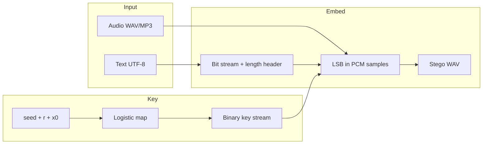

| مرحله | فایل مرجع (MATLAB) | Dart / C# |
|-------|-------------------|-----------|
| نقشه لاجستیک | `logistic_map_keygen.m` | `logistic_map.dart` |
| LSB نهان‌نگاری | `embed_extract_data.m` | `lsb_codec.dart` |
| متریک‌ها | `evaluate_stego.m` | `metrics.dart` |
| جریان اصلی | `main_steganography.m` | `stego_engine.dart` |

منبع حقیقت الگوریتم: **`src/Matlab/`** — کلاینت‌ها همان قرارداد (طول پیام به بیت، کلید، PCM 16-bit) را پیاده می‌کنند.

---

## Common issues

| مشکل / Issue | راه‌حل / Fix |
|--------------|--------------|
| پیام بازیابی نمی‌شود / Cannot extract | طول بیت، `r`، `x0` و `seed` را با زمان embed مقایسه کنید |
| فایل بعد از ارسال خراب است / File corrupted after share | WAV را به‌صورت **فایل** بفرستید، نه Voice |
| `Release signing not configured` | `key.properties` + `upload-keystore.jks` (راهنمای کافه‌بازار) |
| `ANDROID_HOME` not found | Android SDK را نصب و متغیر محیطی را تنظیم کنید |
| GitHub Actions متوقف / Actions blocked | `.\_publish-local-github-release.ps1` یا self-hosted runner — [`docs/GITHUB_RELEASE.md`](docs/GITHUB_RELEASE.md) |
| ظرفیت صوت کم / Low audio capacity | پیام کوتاه‌تر یا فایل صوتی بلندتر انتخاب کنید |

---

## Technology stack

| Layer | Stack |
|-------|--------|
| Mobile / desktop UI | Flutter 3.41, Dart 3.11, Riverpod |
| Windows desktop (alt.) | .NET 10, WPF |
| Algorithm reference | MATLAB (`src/Matlab/`) |
| Steganography | LSB + logistic chaos map key |

## Related documentation

- [`docs/cafebazaar-publish-guide.md`](docs/cafebazaar-publish-guide.md) — Cafe Bazaar release (Persian)  
- [`docs/GITHUB_RELEASE.md`](docs/GITHUB_RELEASE.md) — GitHub tag `publish` workflow  
- [`docs/cafebazaar/screenshots_16x9/README.md`](docs/cafebazaar/screenshots_16x9/README.md) — Screenshot index  
- [`Cursor.01.plan.md`](Cursor.01.plan.md) — Development plan and history (JSON Prompt)  
- [`readmehistory.md`](readmehistory.md) — Change log  

## Thesis context

Research project: **audio signal stealth steganography via logistic chaos mapping** — NTK / Karavi thesis. MATLAB scripts are the algorithm source of truth; Flutter and WPF clients implement the same pipeline for practical use and store distribution.

---

## License

Academic / thesis research project. See repository policy and supervisor guidelines before commercial redistribution.
